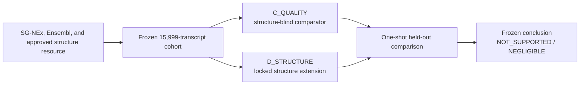
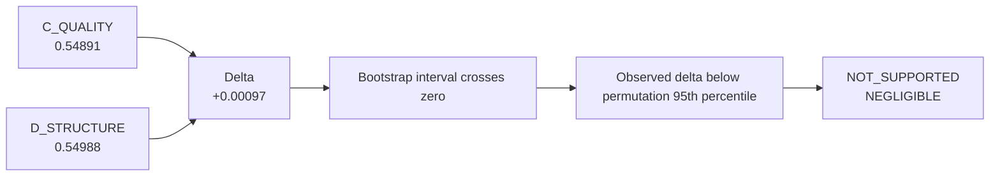
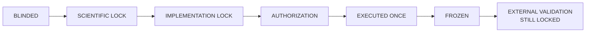

# OmicsEdgeBio Project 001: RNA Observability

Can transcript sequence, annotation, abundance, assay quality, and independently
measured RNA structure explain workflow-specific transcript measurement behavior
across short- and long-read RNA sequencing?

"RNA observability" is provisional shorthand for a defined measurement
phenotype. It is not biological truth, technology-intrinsic accuracy, a clinical
score, or a claim that an undetected transcript is absent.

## Frozen development result

The one authorized Model D development comparison is complete and frozen. Adding
the locked experimental structure features to the strongest locked non-biological
comparator produced a near-zero held-out increment that did not pass the
statistical, practical-magnitude, or permutation-calibration gates.

| Quantity | Frozen value |
|---|---:|
| C_QUALITY macro-F1 | 0.54890983706729 |
| D_STRUCTURE macro-F1 | 0.5498834635530492 |
| D_STRUCTURE - C_QUALITY | +0.0009736264857591603 |
| Paired bootstrap interval | [-0.0023443180806064804, 0.004123505221307526] |
| Negative-control permutation 95th percentile | 0.0015090734133574142 |
| Strict-callability delta | +0.0007399110130869024 |
| Strict-callability bootstrap interval | [-0.0034377341044534047, 0.004809181103569267] |
| Locked conclusion | **NOT_SUPPORTED / NEGLIGIBLE** |

This result does **not** establish that RNA structure is biologically irrelevant.
It says that, within the frozen 15,999-transcript K562 cohort, named Salmon
1.9/Ensembl 91 workflows, cross-study GSE132099 structure proxy, fixed features,
folds, and decision rules, the structure increment was not supported beyond the
locked comparator. The negative result is retained as scientific evidence, not
treated as a pipeline failure.





## Four questions that must remain distinct

1. **Workflow observability:** whether a transcript meets the frozen five-class
   supported-detection definition under named sequencing and quantification
   workflows.
2. **Structure-feature reproducibility:** whether experimental structure summaries
   reproduce across independently generated structure assays. This is a separate
   structure-only question.
3. **Incremental structure contribution:** whether locked structure features add
   held-out information beyond abundance, sequence, annotation, identifiability,
   and assay-quality controls. The frozen development answer is
   `NOT_SUPPORTED / NEGLIGIBLE`.
4. **External transport:** whether the fixed workflow phenotype and a fixed
   structure-blind deployment estimator transport to an independent sequencing
   context. This cannot validate or rescue the structure increment.

## Development design

The endpoint `workflow_detection_v1` uses transcript-level Salmon TPM from
independent biological preparations:

- Illumina support: TPM >= 1 in both of two outcome preparations;
- ONT direct-RNA support: TPM >= 1 in at least three of four outcome preparations;
- classes: `BOTH`, `ILLUMINA_ONLY`, `DIRECT_RNA_ONLY`, `NEITHER`, and
  `INDETERMINATE` for intermediate support.

Five folds keep same-gene and sequence-similarity groups together. Model C uses
nine frozen structure-blind abundance, sequence, and annotation features. Model D
adds only the prespecified structure and structure-quality features. Its single
attempt, bootstrap, negative-control permutations, strict-callability sensitivity,
and decision gates were locked before structure access.



## External validation status

LongBench remains **LOCKED**. Local pre-exposure evidence supports only an
outcomes-blind planning candidate for possible transport of the fixed phenotype
and structure-blind baseline. Multiple compatibility facts remain `UNKNOWN`, no
feature-access or scoring authorization exists, and no LongBench prediction or
metric has been computed. LongBench has no verified matched experimental
structure assay for these contexts and cannot validate Model D.

On 2026-09-25, a quarantined session received accidental result-bearing tutorial
text in a search response. It stopped immediately without repository changes,
file access, bucket listing, transcript-value inspection, prediction, or scoring.
The scientific content is not reproduced here and was not propagated into the
pre-exposure candidate. See the [containment record](metadata/longbench_exposure_incident_20260925.json)
and [external-validation lock](docs/external_validation_lock.md).

## Reproducibility and governance

The project uses immutable input hashes, fixed transcript/fold manifests,
structure-blind scientific and implementation locks, explicit authorization,
single-attempt markers, saved outputs, and adversarial review. Failed and negative
results are preserved. Public-facing language follows the
[claims register](docs/claims_register.md).

The transparent [Model C deployment estimator](docs/model_c_deployment_estimator.md)
was fit once after development from the frozen Model C matrix. It is explicitly
not a reconstruction of historical out-of-fold predictions and not new
development evidence. Its JSON state records the scaler and logistic-regression
parameters without a pickle.

Safe offline verification does not execute Model D or access LongBench:

```bash
python3.11 scripts/validate_repository.py
python3.11 scripts/materialize_model_c_deployment.py --verify
PYTHONPATH=src python3.11 scripts/check_longbench_release.py
python3.11 -m unittest discover -s tests -v
git diff --check
```

The LongBench checker must report `LOCKED_RELEASE_CONDITIONS_UNMET`. Do not run
the Model D execution entry point, fit the deployment estimator again, or supply
external data paths as a reproduction shortcut.

## Repository layout

| Path | Purpose |
|---|---|
| `configs/` | Frozen scientific, implementation, deployment, and validation policies |
| `metadata/` | Dataset registry, cohort/fold manifests, hashes, receipts, and attempt records |
| `src/rnaobs/` | Tested analysis and fail-closed governance helpers |
| `scripts/` | Fixed-path materialization, verification, and repository checks |
| `analysis/` | Historical structure-blind analysis implementation |
| `results/tables/` | Small tracked frozen summaries and predictions allowed by policy |
| `docs/` | Scientific rationale, limitations, reviews, locks, and reproducibility records |
| `tests/` | Synthetic, integrity, governance, and saved-artifact verification tests |
| `data/`, `.cache/` | Ignored source/derived data locations; never public data payloads |

## Data, licensing, and citation

Source datasets and large reference files are not committed. They retain their
own terms. SG-NEx is recorded as CC BY-NC 4.0; LongBench catalog metadata records
CC BY 4.0, but its lock remains in force; GEO availability is not treated as a
blanket redistribution license. See [data reuse and licensing](docs/data_reuse_and_licensing.md).

The project code/documentation license, authorship, release version, and DOI are
not finalized. [Citation metadata remains pending](CITATION_PENDING.md), so no
`CITATION.cff`, ORCID, affiliation, or release claim is invented. Repository:
[omicsedgebio/rna-observability](https://github.com/omicsedgebio/rna-observability).
