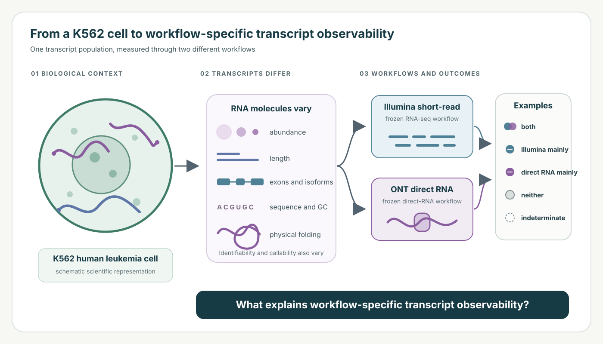
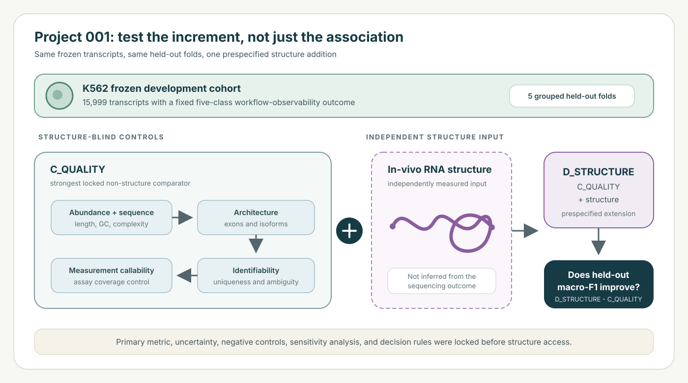
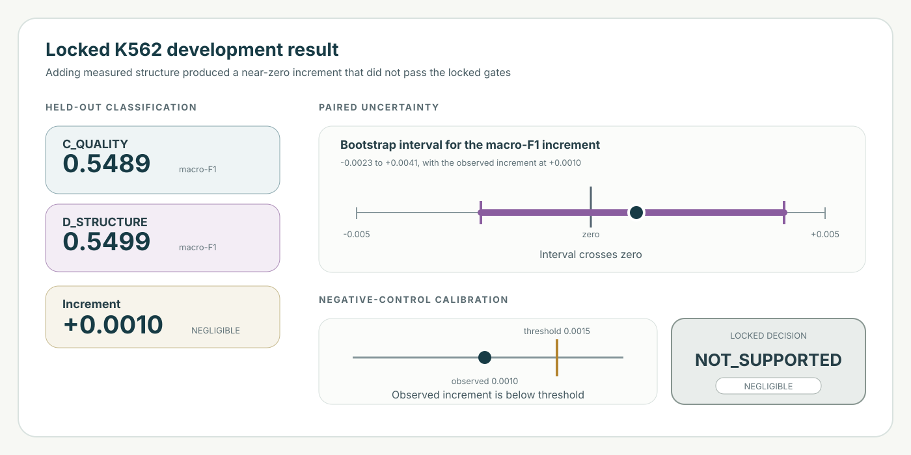

# RNA Observability

## Why can the same RNA transcript appear reliably in one sequencing workflow and unreliably in another?

RNA Observability studies the molecular and technical factors that influence how
consistently transcripts are measured. Project 001 asks one deliberately narrow
question: does independently measured in-vivo RNA structure add reproducible
information about workflow-specific transcript measurement behavior after the
stronger known explanations are already included?



## The problem

RNA sequencing is a measurement process, not a perfectly transparent view of
biology. Transcript abundance reflects biology, but what researchers observe also
depends on how RNA molecules are captured, distinguished, and quantified. A
transcript that is difficult to observe is not automatically biologically absent,
and disagreement between workflows does not by itself identify which measurement
is correct.

Project 001 uses K562, a widely used human leukemia cell line, as its development
system. K562 is a practical biological anchor for this analysis, not a stand-in for
all human cell types. The project compares transcript observability across frozen
Illumina short-read RNA sequencing and Oxford Nanopore Technologies (ONT)
direct-RNA workflows. Neither workflow is treated as biological ground truth.

The frozen phenotype has five formal classes:

| Class | Plain-language interpretation |
|---|---|
| `BOTH` | detected by both workflows |
| `ILLUMINA_ONLY` | supported by the Illumina workflow only |
| `DIRECT_RNA_ONLY` | supported by the direct-RNA workflow only |
| `NEITHER` | supported by neither workflow |
| `INDETERMINATE` | insufficient or conflicting replicate support |

These are workflow-specific measurement outcomes under named protocols,
quantification settings, and thresholds. They are not universal properties of a
transcript or either sequencing technology.

## What was already known?

Many reasons for uneven or workflow-dependent RNA measurement were established or
actively studied before this project.

| Established area | Why it matters for measurement |
|---|---|
| Transcript abundance | Low abundance makes reliable detection harder. |
| Sequence and GC effects | Sequence composition can influence library preparation, read generation, and quantification. |
| Isoform ambiguity and sequence uniqueness | Similar transcripts can be difficult to distinguish from the reads they produce. |
| Transcript architecture | Length, exon structure, splice patterns, and isoform complexity affect quantification. |
| Workflow effects | Protocols, platforms, chemistry, and quantifiers measure RNA differently. |
| Measurement callability | An assay may cover some transcripts or positions more completely than others. |
| RNA structure | RNA folding is biologically meaningful and can influence biochemical accessibility and measurement processes. |

These concepts are not claimed as discoveries of RNA Observability. The supporting
and contradictory literature reviewed for this project is recorded in the
[prior-art matrix](docs/prior_art_matrix.tsv), with the claim boundary documented
in the [novelty gate](docs/novelty_gate.md) and
[claims register](docs/claims_register.md).

## What was missing?

RNA structure is a plausible contributor because RNA molecules physically fold and
structural context can affect biochemical access. But a simple association between
structure and sequencing behavior could reflect abundance, GC content, transcript
architecture, identifiability, or assay coverage instead.

> **Known:** RNA structure can matter biologically, and structure-sensitive
> measurement effects have prior art.
>
> **Question tested here:** Does independent experimental in-vivo structure improve
> prediction after abundance, sequence, transcript architecture, isoform
> identifiability, and measurement callability are already accounted for?

Within the prior-art set reviewed for this project, the literature establishes
sequencing bias, structure-sensitive measurement effects, transcript
identifiability, quantification difficulty, and cross-workflow disagreement
individually. The reviewed literature did not establish this exact combined test:
whether independently measured in-vivo RNA structure adds transcript-level
predictive information for a workflow-observability phenotype after abundance,
sequence, architecture, identifiability, and callability are already accounted
for.

This is a bounded gap statement, not a categorical claim of being the first study
ever to examine RNA structure or sequencing bias.

## Project 001 test design



The frozen development cohort contains 15,999 transcripts. The endpoint,
`workflow_detection_v1`, uses transcript-level Salmon TPM from independent
biological preparations:

- Illumina support requires TPM at least 1 in both of two outcome preparations.
- ONT direct-RNA support requires TPM at least 1 in at least three of four outcome
  preparations.
- Intermediate replicate support is labeled `INDETERMINATE`.

Five held-out folds keep same-gene and sequence-similarity groups together. The
strongest locked structure-blind comparator, `C_QUALITY`, includes abundance,
sequence, transcript architecture, identifiability, and callability controls.
`D_STRUCTURE` adds the prespecified, independently measured in-vivo structure
feature. The primary comparison asks whether pooled held-out macro-F1 improves on
the identical transcript rows and folds.

Macro-F1 summarizes classification performance while giving each outcome class
equal importance. The comparison, uncertainty procedure, negative-control
permutations, practical thresholds, strict-callability sensitivity analysis, and
decision rules were locked before structure access. This was a pre-structure lock
after inspection of structure-blind baseline performance, not a prospective
preregistration.

## What did we find?



In this locked K562 development analysis, measured RNA structure did not provide
supported incremental predictive information beyond the stronger technical and
transcript-level controls.

This does not mean RNA structure is biologically irrelevant.

| Frozen quantity | Exact value |
|---|---:|
| `C_QUALITY` macro-F1 | 0.54890983706729 |
| `D_STRUCTURE` macro-F1 | 0.5498834635530492 |
| `D_STRUCTURE - C_QUALITY` | +0.0009736264857591603 |
| Five fold deltas | +0.00167985, +0.00235540, -0.00399648, +0.00414337, +0.00124415 |
| Positive folds | 4 of 5 |
| Paired cluster-bootstrap interval | [-0.0023443180806064804, 0.004123505221307526] |
| Negative-control permutation 95th percentile | 0.0015090734133574142 |
| Strict-callability cohort | 15,114 transcripts |
| Strict-callability delta | +0.0007399110130869024 |
| Strict-callability bootstrap interval | [-0.0034377341044534047, 0.004809181103569267] |
| Locked decision | **NOT_SUPPORTED** |
| Practical classification | **NEGLIGIBLE** |

Adding structure changed macro-F1 from about 0.5489 to 0.5499, an increment of
about 0.0010. The paired uncertainty interval crossed zero, and the observed
increment was below the locked permutation calibration threshold of about 0.0015.
The four positive fold deltas and positive strict-callability sensitivity do not
override the failed primary decision gates.

## Why a negative result matters

RNA structure was biologically plausible, but plausibility is not evidence of an
incremental contribution. This design first modeled stronger competing
explanations, then evaluated structure once under locked rules. The observed gain
was too small and insufficiently robust under those rules.

Retaining `NOT_SUPPORTED / NEGLIGIBLE` is useful because it prevents a simple
association, a favorable fold count, or a secondary analysis from being promoted
into a stronger conclusion than the primary evidence allows. Rejecting an
attractive explanation when evidence is insufficient narrows the scientific
question and makes later work more honest.

## What RNA Observability means more broadly

RNA Observability is a reliability-oriented framework for asking which molecular
and technical characteristics make transcripts consistently measurable across
sequencing workflows. It separates several layers that can otherwise be conflated:

1. biological context and abundance;
2. sequence and physical structure;
3. transcript architecture and identifiability;
4. assay callability and quantification;
5. workflow-specific measurement behavior.

These layers are framework questions, not a claim that every layer has been shown
to cause observability differences. Project 001 is one bounded test within that
broader direction. It is not a clinical tool, a patient-level score, or a platform
recommendation.

## For researchers

### Scientific scope and records

The current scientific interpretation is anchored in the
[research question](docs/research_question.md),
[hypotheses](docs/hypotheses.md),
[claims register](docs/claims_register.md), and
[Model D development adjudication](docs/model_d_development_adjudication.md).
Historical documents remain part of the research record and may contain earlier
provisional language. The current frozen result supersedes those earlier states
without rewriting the chronology.

Four questions must remain distinct:

1. **Workflow observability:** whether a transcript meets the frozen five-class
   supported-detection definition under named workflows.
2. **Structure-feature reproducibility:** whether experimental structure summaries
   reproduce across independently generated structure assays.
3. **Incremental structure contribution:** whether the locked structure feature
   adds held-out information beyond the frozen controls. The development answer is
   `NOT_SUPPORTED / NEGLIGIBLE`.
4. **External transport:** whether the fixed phenotype and a fixed structure-blind
   deployment estimator transport to an independent sequencing context. This
   cannot validate or rescue the structure increment.

The frozen plans, specifications, and interpretation boundaries are available in:

- [frozen analysis plan](docs/frozen_analysis_plan.md)
- [structure feature specification](docs/structure_feature_specification.md)
- [Model D scientific adjudication](docs/model_d_development_adjudication.md)
- [Model D development result freeze](metadata/model_d_development_result_freeze.json)
- [Model C deployment estimator](docs/model_c_deployment_estimator.md)
- [limitations and risks](docs/limitations.md)
- [reproducibility record](docs/reproducibility.md)

### Reproducibility boundary

Python 3.11.12 and the scientific package versions are pinned. The canonical
macOS/Apple Silicon environment reconstructs the frozen Model C deployment
prediction fingerprint exactly. Hosted Linux/x86_64 CI can differ in the final
floating-point bits, so it omits exactly that one platform-sensitive fingerprint
reconstruction test. Frozen deployment artifact hashes and all other portable
tests remain protected in CI. This is a cross-platform numerical reproducibility
boundary, not evidence of model instability.

Safe offline verification does not execute Model D or access LongBench:

```bash
PY=/Users/priyanshpathak/Projects/omicsedgebio/rna-observability-execution/.venv/bin/python
"$PY" scripts/validate_repository.py
"$PY" scripts/materialize_model_c_deployment.py --verify
"$PY" scripts/check_longbench_release.py
"$PY" -m unittest discover -s tests -v
git diff --check
```

Do not run the Model D execution entry point, fit the deployment estimator again,
or supply external data paths as a reproduction shortcut.

### External validation status

LongBench remains **LOCKED** with status
`LOCKED_RELEASE_CONDITIONS_UNMET`. There is no feature-access authorization and no
scoring authorization. No LongBench prediction or metric has been computed, and
LongBench has no verified matched experimental structure assay for these contexts.
It has not validated Model D and cannot rescue the frozen development conclusion.
See the [external-validation lock](docs/external_validation_lock.md) and
[outcomes-blind candidate plan](docs/longbench_external_validation_plan.md).

On 2026-09-25, a quarantined session received accidental result-bearing tutorial
text in a search response and stopped immediately. No repository change, file
access, bucket listing, transcript-value inspection, prediction, or scoring
followed. The scientific content was not propagated. See the
[containment record](metadata/longbench_exposure_incident_20260925.json).

### Repository map

| Path | Purpose |
|---|---|
| `configs/` | Frozen scientific, implementation, deployment, and validation policies |
| `metadata/` | Dataset registry, cohort and fold manifests, hashes, receipts, and attempt records |
| `src/rnaobs/` | Tested analysis and fail-closed governance helpers |
| `scripts/` | Fixed-path materialization, verification, and repository checks |
| `analysis/` | Historical structure-blind analysis implementation |
| `results/tables/` | Small tracked frozen summaries and predictions allowed by policy |
| `docs/` | Scientific rationale, limitations, reviews, locks, and reproducibility records |
| `tests/` | Synthetic, integrity, governance, and saved-artifact verification tests |
| `data/`, `.cache/` | Ignored source and derived data locations, never public data payloads |

Source datasets and large reference files are not committed. Immutable input hashes,
fixed transcript and fold manifests, explicit authorization, single-attempt markers,
saved outputs, and adversarial review preserve the distinction between scientific
evidence and workflow state.

### Data, licensing, and citation

Source resources retain their own terms. SG-NEx is recorded as CC BY-NC 4.0;
LongBench catalog metadata records CC BY 4.0, but its lock remains in force; GEO
availability is not treated as blanket redistribution permission. See
[data reuse and licensing](docs/data_reuse_and_licensing.md) and
[third-party notices](THIRD_PARTY_NOTICES.md).

Project-authored software and non-manuscript repository documentation are governed
by the current Apache License 2.0 scope in [LICENSE](LICENSE) and
[LICENSE_SCOPE.md](LICENSE_SCOPE.md). Citation metadata are provided in
[CITATION.cff](CITATION.cff). Priyansh Pathak is the sole author recorded in the
repository release metadata. No DOI, ORCID, affiliation, archival deposit, or
tagged release version is claimed.

Repository: [omicsedgebio/rna-observability](https://github.com/omicsedgebio/rna-observability)
